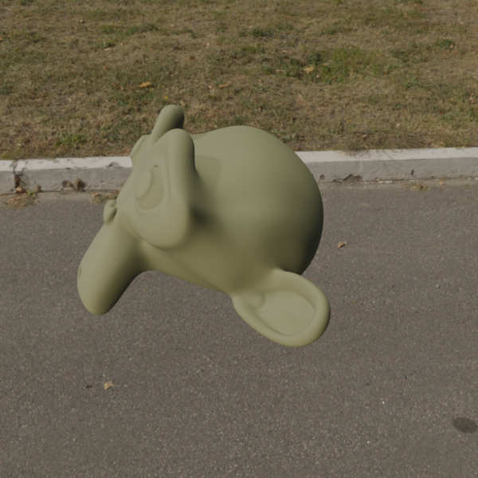

# Shadow Catcher

If you want to render your 3d model with a HDRI background or compose it in a photograph, you'll want a shadow cathcer - an object that will render a shadow of your model. 

The shadow catcher is usually a plane, but if you are looking to project your shadow on an uneven ground or other object, you can use any mesh you want. In this tutorial, we are going to use a plane. Usually, you want this plane to cover quite a large area. Beside that, we are going to start with an HDRI and a Suzanne.

The process however differes significantly in Cycles and Eevee.

## Cycles

In *Cycles*, the shadow catcher is very simple. Select the plane. Go to *Object Properties* (orange icon on the right menu) and expand the visibility tab. Enable *Shadow Catcher* Mask. You also need to disable *Diffuse* and *Glossy* ray visibilty, to prevent the plane affecting the lighting of your model. 

Comparison renders, without and with the shadow catcher plane.

## Eevee

In *Eevee*, we need to improvize a bit. We need to create a shader, that is transparent as a base, and mixes in shadows where they should be, with the expected intensity. Ideally, we would also like to derive the color of the shadow(s) base on the color of the light(s), however, that is outside of the scope of this tutorial.

First, you probably notice that in *Eevee*, the HDRI ligting won't cast any shadows in the first place, so add a sun lamp to the scene and angle it in some direction to approximately match the HDRI. 

Select the plane and create a new material. Make sure to set *Alpha Blend* transparency mode both for the Blend mode and *Opaque* for the Shadow Mode in the *Material Properties*.

Delete the default Principled BSDF. We are going to start with adding a *Mix Shader* node and plug it in the *Material Output*. Create a new *Diffuse BSDF* and set the color to your preffered shadow color (pure black for most scenes). Plug this node, along with a new *Transparent BSDF* node into the previously added *Mix BSDF*. This is what it should be looking right now - if you see something else, double check your material settings. 

Now, we need to properly manage where the shadows should appear. For that, we need to use a regular shader to render it 'in the background' and then use that to control the *Fac* of our *Mix Shader*. Add another *Diffuse BSDF*, this time set to pure white. This is our source of the shadow. Plug it in a *Shader to RGB* node to fake-render it, and pass output of that node in *RGB to BW* to get rid of any unwanted color information. Plug this in the *Fac* of *Mix Shader*. This is basically telling the Blender to render black were is shadow, and render transparent where is none.

However, we can still see the shadow catcher almost 'glowing'. We need to cap the values of the fake-render to get rid of this effect. Drop an *RGB to BW* and *ColorRamp* node beteen the *Shader to RGB* and *Mix Shader*. Drag the *ColorRamp* slider around to control the shadow intensity.  And you are done! 

____
Mistakes? Bad grammar? Unclear wording? Outright wrong information?\
*kiraa@mail.muni.cz* is the one to blame!\
https://github.com/kiraacorsac/VV035-blender-study-materials/

Anything and everything dicussed here you can probably find in official documentation too, in more detail.
https://docs.blender.org/manual/en/latest/getting_started/index.html

