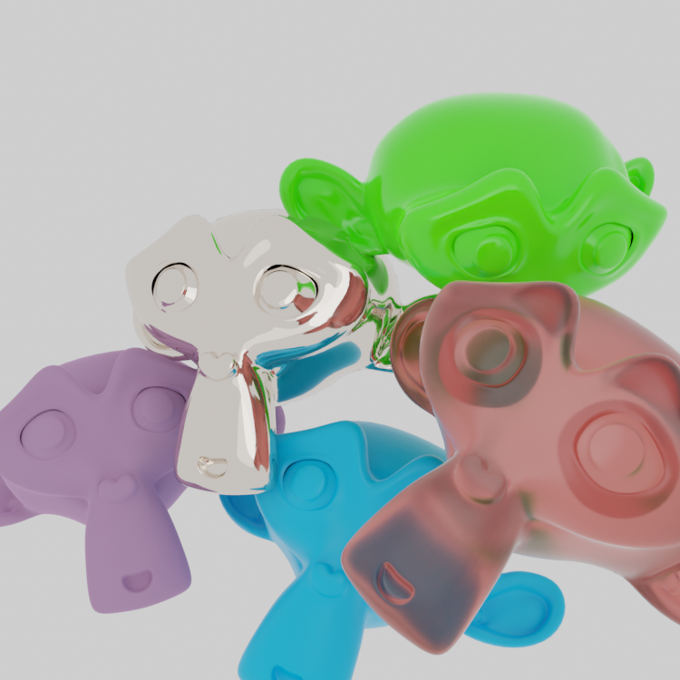
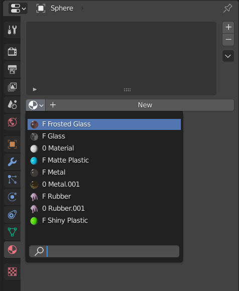
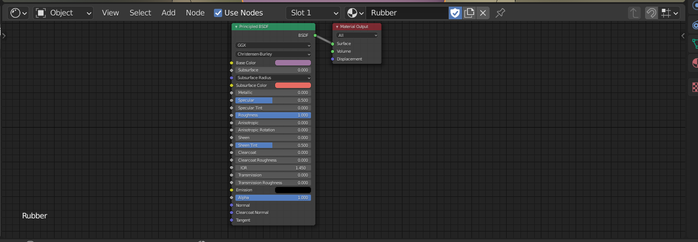

# Materials

Materials describe how individual objects react to light. It includes the color, reflections, translucency, but might also affect the geometry. In the following picture you have examples of different kinds of materials quickly achievable in blender. In this lesson, we won't go into how materials work and how to create one properly, just how they are managed. This tutorial expects you already have some created -- a file with some materials pre-created is for example the 'base' for Assignment 02.

## Changing materials

Select an object. Then, on the right among other properties, click on the red checkered ball icon. Afterwards, you can click on the white checkered ball and you'll be presented with a dropdown of materials that already exists. If you don't have any, you might want to click *New* to create a new material.

## Working with materials

We are going to be working with nodes. We are not going to realize their full potential yet, we are just looking around. Switch to the *Shading* workspace. A node network with a single *Principled BSDF* shader should appear.

*Tip: You might have heard that nodes are 'difficult'. Well you are in luck: most people who find them hard to understand have no experience with programming. Nodes are, in a certain way, a programming language. And you are already used to those.*

Before you begin: if you start changing around your material, you might have hard time getting it back. It will also affect every object with that material assigned in your scene. Make sure you make a new copy of your material, if you want to play with something you might want later.

On the top of the node network, you will find a name of the material and three buttons next to it. You can click on:
 - the name to rename your material,
 - white checkered ball to change the material you are working on,
 - the shield to make make sure your material gets saved in your .blend file (otherwise, it will disappear if it's not assigned!)
 - the two papers to copy the material.
 - 'x' to unlink your material (means it will be deleted after restarting blender)

We won't be working with any other shaders today. We won't even go into the details about the *Principled BSDF*, as there are some physics to explain. Note however that you can change: 

- *Base Color* to change the diffuse color
- *Metallic* to get metal-like physical properties. If you are modeling an dielectric (insulator) material, leave this on 0. You want to work with *Roughness* slider instead!
- *Roughness*, that is an inverse of glossines of the material. If you want your material to be reflective (glass, ceramics, certain plastics), turn this down to 0. For rough materials like wallpaint, rubber, cloth, turn this up.
- *Transmission* to make the material translucent (create glass).

____
Mistakes? Bad grammar? Unclear wording? Outright wrong information?\
*kiraa@mail.muni.cz* is the one to blame!\
https://github.com/kiraacorsac/VV035-blender-study-materials/

Anything and everything dicussed here you can probably find in official documentation too, in more detail.
https://docs.blender.org/manual/en/latest/getting_started/index.html

