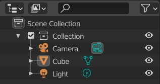
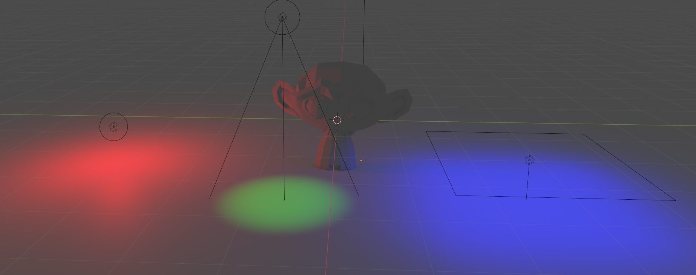

# Objects

Most important thing to know is that you select an object by **Left-clicking** it. 

As stated before, in the top left you can see a list of every object in the scene, in an *Outliner*. You should have one *Collection* of items - a *Camera*, a *Light* and a default *Cube*. We will focus mainly on the meshes (such as the *Cube*), but note that most of what you learn in this section can be applied to any object type. You can *Hide in Viewport* individual objects by clicking the eye icon next to the object.

## Transforming objects

### Moving

Select the default cube by **Left-clicking** on it. On the left of the screen, a *Move* icon appears as a cross, third from the top. Click the icon while the cube is selected. Transformation handles for moving object around individual axis will appear. Try dragging one of the arrows to move the cube on a single axis, dragging one of the squares to move at two axes at the same time, even grabbing the cube itself to move 'intuitively' in all three axes at the same time! 

To quickly move the cube around you can also press the **G** button. If you press **X**, **Y** or **Z** afterwards, you can move this object one axis at the time.

### Rotating
Make sure the cube is selected. Similarly to the movement, you can rotate your cube with the icon just bellow it. You can rotate on a single axis by grabbing the handles, perpendicular to the viewport by grabbing the edge of the circle, or as a 'trackball' by grabbing the cube itself.

Use the shortcut **R** to quickly get to rotation mode. Press it multiple times to toggle different modes, or **X**, **Y**, **Z** to pick axes of rotation! 

### Scaling
Once again, make sure the cube is selected. The scaling button is once again bellow the last one. Feel free to try out the different transformation handles to scale at different axis, two axes at once, or grab the cube to scale it proportionally on every axis.

To quickly make any object bigger or smaller, use the **S** key. As usual, **X**, **Y**, **Z** picks axes.

## Adding, removing, copying, pasting

In the viewport, in the upper left section is a row of buttons. Locate the *Add* button, then go to *Mesh*. In there, pick a mesh to be added to the scene. For example, the *Monkey*. Try it out and move theme around the scene!

Now, when you sufficiently cluttered your scene, it's time to remove some objects. Select some object and press **X** or **Delete** to remove it from the scene permanently.

You can also copy and paste any object as you are used to - **Ctrl + C** and **Ctrl + V**. The pasted object appears in the exact same place as the original, be sure to move it.

*Tip: The **Monkey** is called **Suzanne**.*

## Smooth Shading
To turn on smooth shading, select and object, then right click on it (it has to be selected first!), and select *Shade Smooth* from the *Object Context Menu*.

## Lights

You can add and remove lights as any other primitive object via the *Add -> Light* menu. You have a choice of four different light kinds On the picture, you see the *Point*,*Spot* and *Area*. *Sun* is not shown, as it affects the whole scene ad once.

Use standard controls for positioning and rotating. In the properties (on the right, look for a green light bulb) You can adjust light *Color* and *Power* (or *Strength* in case of the *Sun*) in the light properties, after selecting a light.

#### Point 
A standard non-directional light source, like a flame or a naked lightbulb.

#### Sun
Sun simulates a sun in the sky - position of this light does not matter, only the angle. 

#### Spot
Spotlight or a handheld torchlight. You can define it's size and the borders in the *Spot Shape* menu. 

#### Area
Like a floodlight, a window or an LED panel. Direction matters. You can define the shape in the properties. 

*Tip: If you are using Eevee and working with thin geometry, you might want to turn on addtional features to prevent light bleeding to the other side. In the light properties, open up the **Shadow** dropdown and make sure **Contact Shadows** is turned on.  

____
Mistakes? Bad grammar? Unclear wording? Outright wrong information?\
*kiraa@mail.muni.cz* is the one to blame!\
https://github.com/kiraacorsac/VV035-blender-study-materials/

Anything and everything dicussed here you can probably find in official documentation too, in more detail.
https://docs.blender.org/manual/en/latest/getting_started/index.html

