# Blender 2.9x Basics

## First-Time Setup
After the first startup, you will be prompted with a quick-setup screen. These tutorials will assume you have your shortcuts set to *Blender* and your **Spacebar** action to *Search*, however, if you already know the basics you might be more comfortable with another setup. For example, if you are transitioning to Blender from Maya or 3D Max, you might prefer your shortcuts set to *Industry Compatible*. Click *Save New Settings* to proceed.

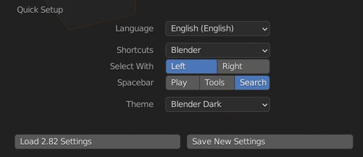

## Splash Screen
You will be welcomed with this screen on every Blender startup. Most of the time, you'll want to either use *Open...* to open an existing project, or create a new *General* file. 

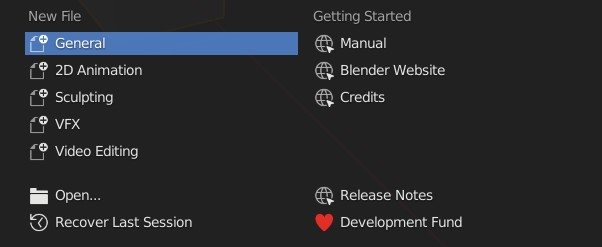

*Tip: Do you make mistakes? I do! Let's raise the **Undo Limit** from the default 32 to something bigger. Go to **Edit (upper menu) -> Preferences -> System** and raise the **Undo Limit** to something more reasonable, like 128.*

## Workspace

If you've created a new *General* file, you should be dropped into a standard *Layout* workspace with one *3D viewport* taking up most of the screen. In this viewport, you are probably going to spend vast majority of the time. An *Outliner* in the top right showing what objects are present on the scene, and *Properties* below that, allowing you to modify the properties of a selected object. In the center of the viewport, a single default cube is present. 

In the upper left of the viewport, you can find viewport mode. In the *Layout* workspace, it is usually set in *Object mode*. 

Also note the selection of workspaces, represented as window tabs on the top. Feel free to explore the different workspaces, and different viewport modes,but make sure you are back in *Layout* and *Object mode* for the next step.

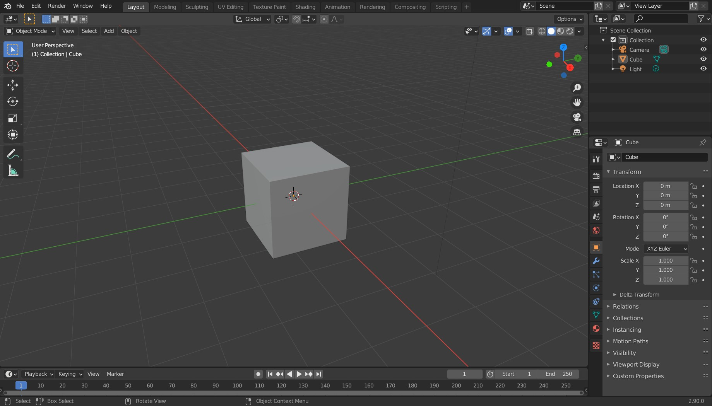

## Looking around

### Zoom
**Scroll** up and down to zoom in or zoom out.

### Orbiting 

**Middle-click** anywhere in the viewport and pan around to rotate around the center of the screen.

### Panning 

Use **Shift + Middle-click** to move your camera around the viewport.

*Tip: Do you prefer zooming where your mouse is? It seems more intuitive to most people I know. Go to  **Edit (upper menu) -> Preferences -> Navigation** and turn on **Zoom To Mouse Position**. And while you there, you may like the option **Orbit Around Selection** too? Note that these are my personal preferences and might not suite everyone, so feel free to try out everything, and figure out what works the best for you!*

*Tip: No middle mouse button? Maybe you prefer a trackpad or a graphics tablet instead of a mouse? Turn on the ability to use **Alt + Left-click** instead of a **Middle-click**. You can find this option in **Edit -> Preferences -> Input**. Enable **Emulate 3 Button Mouse**.*
 
*Tip: I use the combination of **Zoom To Mouse Position** and orbiting to get basically everywhere. It makes for very intuitive and quick movement. Using panning seems clunky in comparison.*

## Objects

Most important thing to know is that you select an object by **Left-clicking** it. 

As stated before, in the top left you can see a list of every object in the scene, in an *Outliner*. You should have one *Collection* of items - a *Camera*, a *Light* and a default *Cube*. We will focus mainly on the meshes (such as the *Cube*), but note that most of what you learn in this section can be applied to any object type. You can *Hide in Viewport* individual objects by clicking the eye icon next to the object.

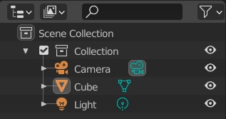

### Transforming objects

#### Moving

Select the default cube by **Left-clicking** on it. On the left of the screen, a *Move* icon appears as a cross, third from the top. Click the icon while the cube is selected. Transformation handles for moving object around individual axis will appear. Try dragging one of the arrows to move the cube on a single axis, dragging one of the squares to move at two axes at the same time, even grabbing the cube itself to move 'intuitively' in all three axes at the same time! 

To quickly move the cube around you can also press the **G** button. If you press **X**, **Y** or **Z** afterwards, you can move this object one axis at the time.

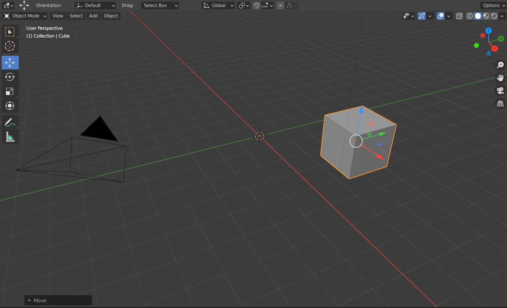

#### Rotating
Make sure the cube is selected. Similarly to the movement, you can rotate your cube with the icon just bellow it. You can rotate on a single axis by grabbing the handles, perpendicular to the viewport by grabbing the edge of the circle, or as a 'trackball' by grabbing the cube itself.

Use the shortcut **R** to quickly get to rotation mode. Press it multiple times to toggle different modes, or **X**, **Y**, **Z** to pick axes of rotation! 

#### Scaling
Once again, make sure the cube is selected. The scaling button is once again bellow the last one. Feel free to try out the different transformation handles to scale at different axis, two axes at once, or grab the cube to scale it proportionally on every axis.

To quickly make any object bigger or smaller, use the **S** key. As usual, **X**, **Y**, **Z** picks axes.

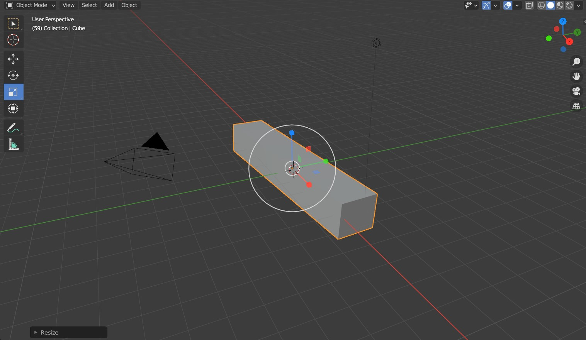

### Adding, removing, copying, pasting

In the viewport, in the upper left section is a row of buttons. Locate the *Add* button, then go to *Mesh*. In there, pick a mesh to be added to the scene. For example, the *Monkey*. Try it out and move theme around the scene!

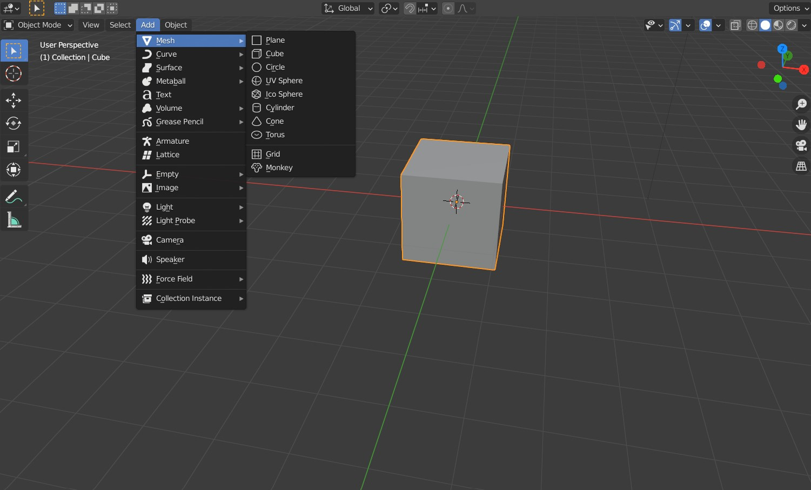

Now, when you sufficiently cluttered your scene, it's time to remove some objects. Select some object and press **X** or **Delete** to remove it from the scene permanently.

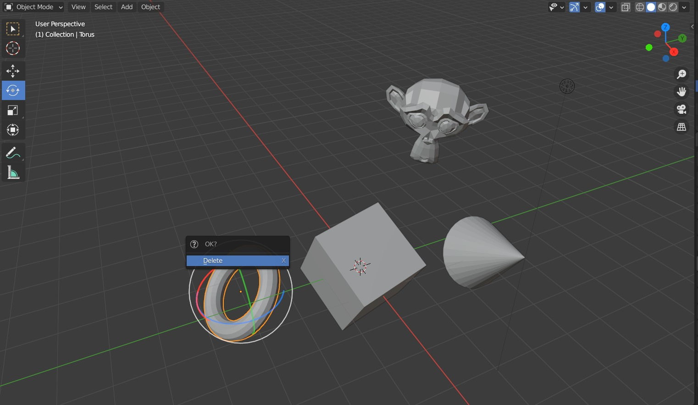

You can also copy and paste any object as you are used to - **Ctrl + C** and **Ctrl + V**. The pasted object appears in the exact same place as the original, be sure to move it.

*Tip: The **Monkey** is called **Suzanne**.*

### Lights

You can add and remove lights as any other primitive object via the *Add* menu. You have a choice of four different light kinds -- *Point*, *Sun*, *Spot*, *Area*.

#TODO

### Smooth Shading
To turn on smooth shading, select and object, then right click on it (it has to be selected first!), and select *Shade Smooth* from the *Object Context Menu*.

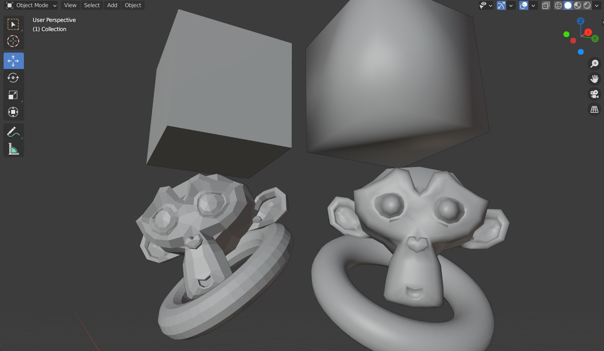

## Viewport Settings

### Orthograpic view
To turn on the orthographic view, find the four buttons in a column on the upper left part of the viewport and click the last one. 

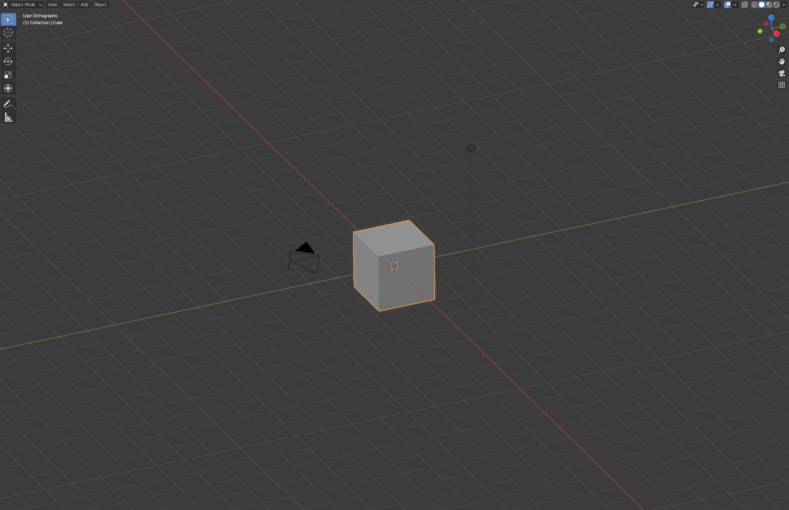

### Viewport shading

The four buttons on the upper left in a row are used to select how the object in a viewport are represneted. You have a choice between a *Wireframe*, default *Solid*, a *Material Preview* (more on materials later), and *Rendered*. The last one is a great feature of *Eevee Engine*, currently unique to Blender. With *Eevee* you can get realtime previews, comparable in quality to raytraced renders that can take tens of minutes, or even hours to complete with conventional methods!

The following picture is a viewport render with a decent amount of polygons. I was able to run this on computer a running Intel HD integrated graphics card. And this is only a quick demo - *Eevee* can handle much, much more! 

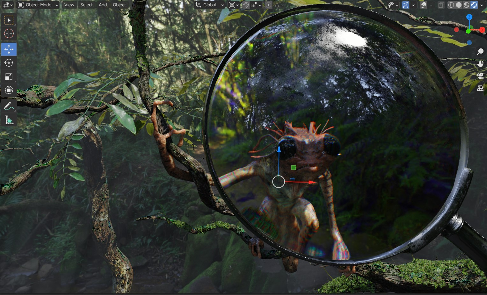

____
Mistakes? Bad grammar? Unclear wording? Outright wrong information?\
*kiraa@mail.muni.cz* is the one to blame!\
https://github.com/kiraacorsac/VV035-blender-study-materials/

Anything and everything dicussed here you can probably find in official documentation too, in more detail.