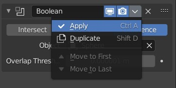
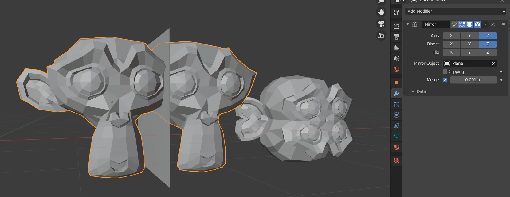

# Modifiers

If you want to quickly and proceduraly deform any object on the scene, you can use a modifier to do so. 

Note that most of the time you need to have enough geometry in place to actualy deform the object - only some of the modifiers will acutally *add* faces, most will just try to their best with whatever you already have in place. You can solve this with *Subdivision Surface* modifier, discussed bellow.

*Tip: to see the exact mesh has your object has, change into the **Modeling Layout** (tabs in the upper part of the Blender window), or at least to **Edit Mode** (upper left of the viewport, it's in **Object Mode** by default).*

To work with modifiers, select the object of your choice and in the properties panel (right) select *Modifier Properties* (a little blue wrench icon).  

### Applying modifiers

If you just create a modifier, it will be proceduraly applied to the mesh, however, it will not modify the mesh. Working with unapplied modifier has two main implications:

1) You can not directly modify the geometry generated with the modifier. You are still able to modify the underlying geometry instead.
2) You are able to remove or change the order of the modifiers at any time (before applying of course).

Applying a modifier, therefore 'baking in' the geometry, is done in the dropdown menu accesed via a little arrow next to the apropriate modifier. Click *Apply* to actually bake in the modifier.

## Subdivision Surface

With this modifier, you are able to quickly and evenly smooth out the geometry. The *Suzanne* on the left is the original model, while the *Suzanne* on the right has a *Subdivision Surface* modifier applied to it.

If you instead of *Catmull-Clark* algorithm choose *Simple*, your mesh will be subdivided, however, no smoothing will actually be applied. This is useful in combination with more modifiers that won't generate their own geometry.

Furthermore, if you want to smooth out a model without acutually generating more geometry, use *Smooth* modifier.

*Tip: many times you don't actually need this modifier to smooth out an object, or at least you can turn down the **Levels** number a bit. Make sure to turn on **Shade Smooth** first (in **Object Mode** select object -> right click -> **Shade Smooth** ).*

## Simple Deform

This modifier groups basic means of mesh deformation. On the picture you can find a simple *Cube* with level 4 *Simple Subdivision Surface* modifier, that has been (from the left):

1) *twisted* 180° in the X axis,
2) *bent* 60° in the Y axis,
3) *tapered* by the factor of 1 in the X axis,
4) *streched* by the factor of 1 in the Z axis.

You can even set a custom origin point of the deformation. 

## Remesh

To quickly remesh the whole geometry (meaning: to generete a new mesh with very similiar shape) you can use a Remesh modifier. Try out different options and play with the numbers to get different effects. You can also play with very similiar modifier *Triangulate*. 

*Tip: Do not confuse this with act of **retopology**, that is usualy a manual process of creating an optimal geometry from a high-resolution (perhaps sculpted) model. Meshes generated with this modifier aim to be interesting, not better quality.* 

## Boolean

With the *Boolean* modifier, you are able to create an *intersection*, *union*, or *difference* of two objects in the scene. As an example, I have used this modifier on *Suzanne* to get a difference of *Suzanne* and a *Sphere* (essentially, subtracting *Sphere* from *Suzanne*). On the right is the setup, on the left you can see the result after hiding the *Sphere*.

## Mirror

One very useful modifier, especially when modeling or sculpting organic creatures that often exhibit symmetry. After adding this modifier (but not applying it!), you can now edit one side of the mesh, and your changes will be instantly reflected on the other side.

You can chose one or more axes of symmetry. More so, you can provide your own *Mirror Object* to define your own arbitrary axis with any other object. In the example on the left, I used a plane to define such axis. Of course, the plane can be hidden for rendering. On the right, the *Suzanne* is mirrored on one of her own axis.

## Other modifiers

Some of the modifiers work with texture maps, UV maps, curves, rigs, physics, animation, and other concepts that we will either discuss later, or are outside of the scope of this course. If a modifier that is not discussed here caught your eye, please, don't hesitate to ask about it!

Note that quite a lot of modifiers from *Generate* and *Deform* categories are actually quite simple, and were not discussed here simply because I don't want this document to be super long. Play around, and see what you can create!

____
Mistakes? Bad grammar? Unclear wording? Outright wrong information?\
*kiraa@mail.muni.cz* is the one to blame!\
https://github.com/kiraacorsac/VV035-blender-study-materials/

Anything and everything dicussed here you can probably find in official documentation too, in more detail.\
https://docs.blender.org/manual/en/latest/getting_started/index.html