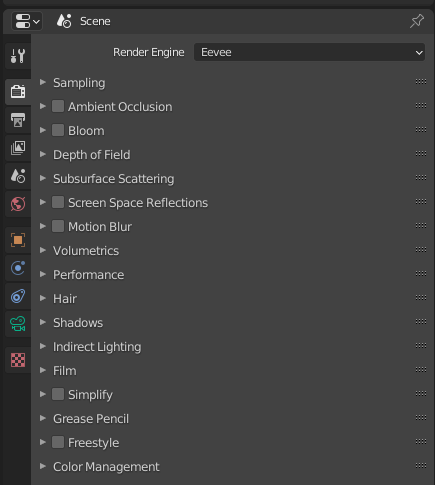

# Rendering

To render, you need to place a camera in your scene. There is one by default, however you can add more via the *Add* menu. To position a camera in space, use either standard movement shortcuts for object transposition/rotation, or position your own viewport camera, press **Space** to activate search, and type *Align Active Camera to View*. 

You can start rendering by pressing **F12**. 

## Render settings

On the right of the viewport in *Layout* or *Modeling* workspace, one can find a rendering tab with an icon of a small camera. The most important setting is the *Render Engine*, followed by *Sampling*.

The engines deserve their own paragraphs, so they are discussed bellow.

About the samples: The higher the number, the nicer the results.  You want to activate *Denoising* to get nicer results basically for free.

## Cycles

## Eevee

Eeevee is a real-time PBR (physically based rendering) engine. It is not, however, a raytracer. It has all the features you would expect -- volumetrics, screen-space reflections, subsurface scattering, ...

Eevee shares a lot of it's material nodes with Cycles, so it's easy to switch between the two, unless you are using exclusive features. Moreover, some of the material nodes such as the default *Principled BSDF* is completly compatible with game engines and you can import it directly. 

However, as *Eevee* is not a true raytracing engine, it can also produce occasional artifacts - especially when it comes to shadows. It can usually be countered with proper settings and high enough sample rate. See the example bellow, and compare with the Cycles Render. Note that I purpousfuly lowered the *TODO* to make the artifact more visible.

