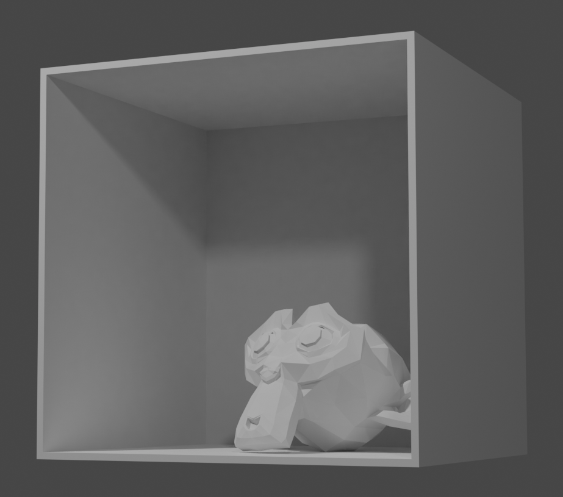
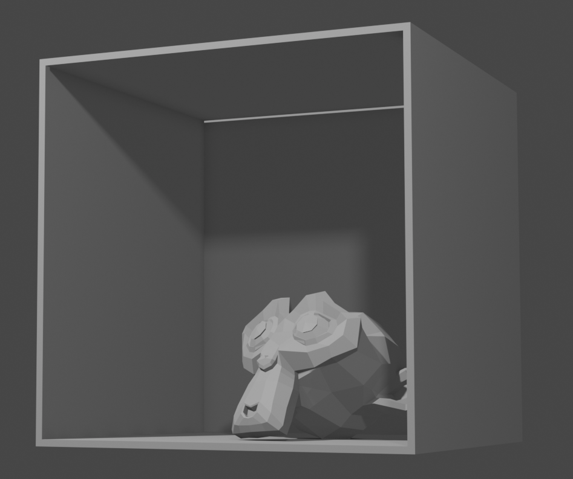

# Rendering

To render, you need to place a camera in your scene. There is one by default, however you can add more via the *Add* menu. To position a camera in space, use either standard movement shortcuts for object transposition/rotation, or position your own viewport camera, press **Space** to activate search, and type *Align Active Camera to View*. 

You can start rendering by pressing **F12**, or see the last render using **F11**. 

## Render settings

On the right of the viewport in *Layout* or *Modeling* workspace, one can find a rendering tab with an icon of a small camera. The most important setting is the *Render Engine*, followed by *Sampling*.

The engines deserve their own paragraphs, so they are discussed bellow.

About the *Samples*: The higher the number, the nicer the results, the longer the wait.  You'll want to activate *Denoising* to get nicer results basically for free. Both of these features can be found in *Sampling*.

In general, use under 256 samples when using *Eevee* (more is usually useless). In *Cycles*, the number is generaly quite variable - I tend to start with somewhere around 128 and go up from there, looking for a render where the noise is acceptable. 
 

## Cycles

Cycles is a raytracing engine - meaing it actually simulates individual rays, attempting to simulate real-world light physics. This comes with one huge drawback - computation time. The image below took minutes to render (altough time could be lowered a bit).  

## Eevee

Eeevee is a real-time PBR (physically based rendering) engine. It is not, however, a raytracer. It has all the features you would expect -- volumetrics, screen-space reflections, subsurface scattering, ...

Eevee shares a lot of it's material nodes with Cycles, so it's easy to switch between the two, unless you are using exclusive features. Moreover, some of the material nodes such as the default *Principled BSDF* is completly compatible with game engines and you can import it directly. 

However, as *Eevee* is not a true raytracing engine, it can also produce occasional artifacts - especially when it comes to shadows. It can usually be countered with proper settings and high enough sample rate. See the example bellow (notice the artifact on the furthermost wall), and compare with the Cycles Render. Note that it took under 1 second to render and can be fixed by turning on *Contact Shadows* on individual lights. 

____
Mistakes? Bad grammar? Unclear wording? Outright wrong information?\
*kiraa@mail.muni.cz* is the one to blame!\
https://github.com/kiraacorsac/VV035-blender-study-materials/

Anything and everything dicussed here you can probably find in official documentation too, in more detail.