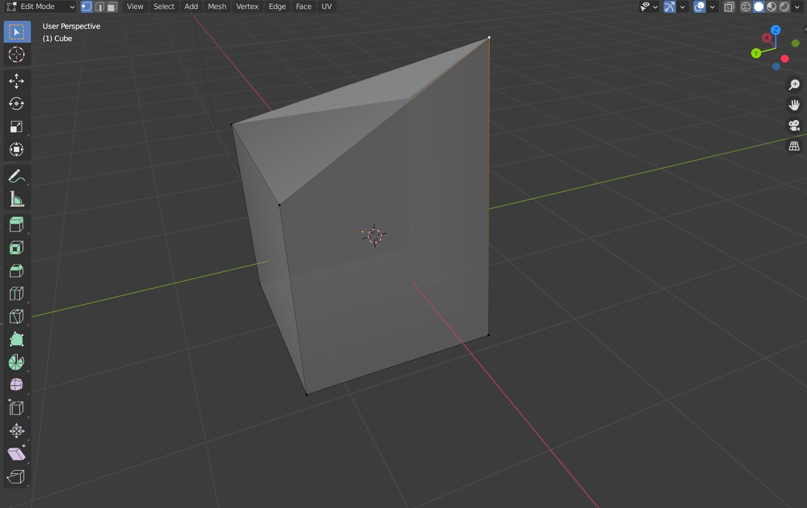
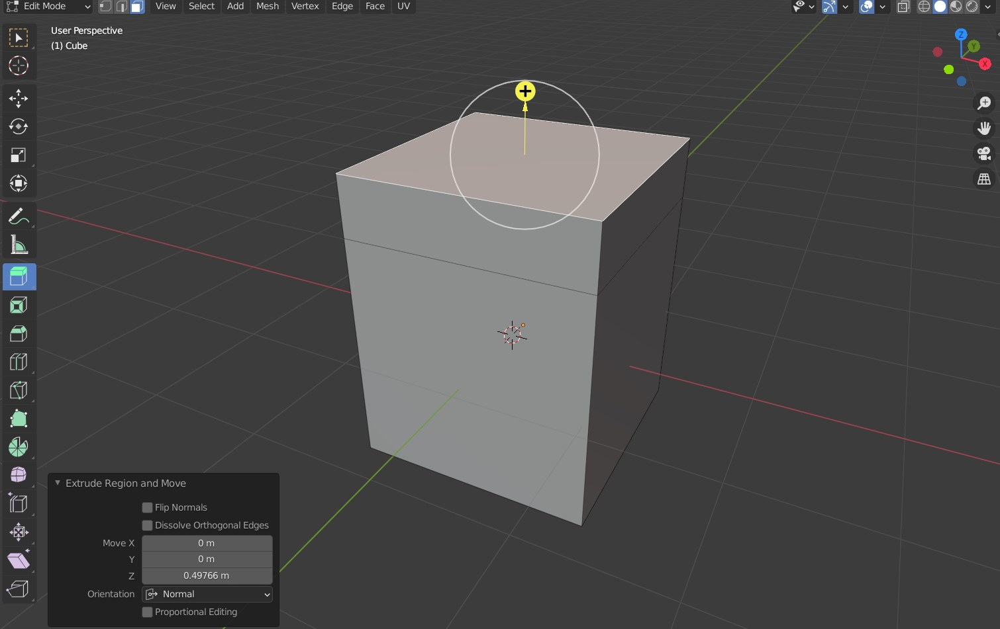
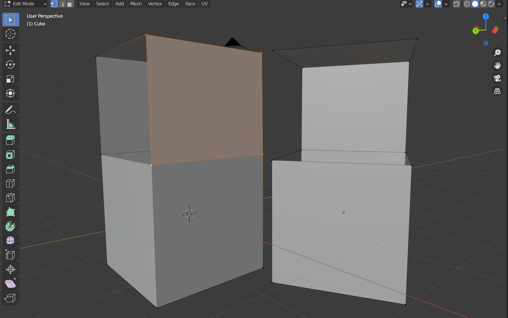
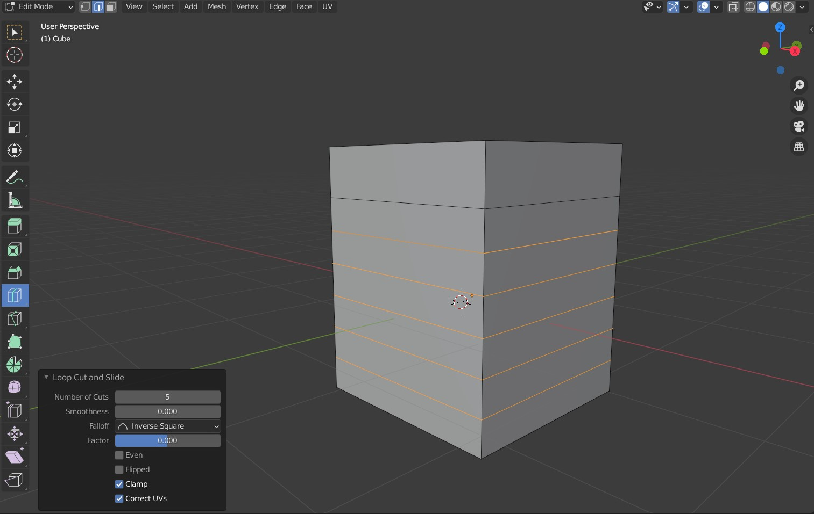

# Edit mode

Edit mode is designed to work with faces, edges and vertices directly. It enables you to create any desired geometry. To go to the edit mode, select a mesh (i.e. not a camera, image...) you want to edit and switch to the modeling workspace, or press **Tab**. 

*Tip: Any mesh created with a modifier you have not applied yet will not be adjustable in the **Edit Mode**. If you want to further refine mesh generated with a modifier, you need to **Apply** them in the **Object Mode** first - bake the generated geometry. Of course, this means the generated mesh is no longer proceduraly generated from underlying object.* 

## Mesh
With meshes, everything is built from three basic structures: *vertices*, *edges* and *faces*.

The most elementary part of a mesh is the *vertex* (vertices plural) which is a single point or position in 3D space. Vertices are represented in the *3D Viewport* in *Edit Mode* as small dots.  

An *edge* always connects two *vertices* by a straight line. The edges are the “wires” you see when you look at a mesh in wireframe view. They are usually invisible on the rendered image. They are used to construct *faces*.

*Faces* are used to build the actual surface of the object. They are what you see when you render the mesh. If this area does not contain a *face*, it will simply be transparent or non-existent in the rendered image.

*Edges* and *faces* in a continuous array form a *loop*. 

*Tip: Keep your geometry all-quads (4-vertex faces) and with a nice loop flow. It's easier to work with, deforms nicely for animation and positioning later, prevents artifacs, and makes sure the modifiers are doing what you need.* 

In the upper right corner of your viewport (in *Edit Mode*), you can find 3 selection options - *Vertex select*, *Edge select*, *Face select*. **Left click** on a part of the mesh to select it. Additionaly, **Double click** to select an edge (face) loop, double click a single edge (face), or press **A** to select everything.  After you select a mesh part of your choice, you can work with it as you are used to - i.e. translate, delete, ...

## Adding geometry

Depending on individual preferences and your current goal, you may want to be adding indiviudual faces, edges, or sometimes even vertices. My favorite generic workflow consists of blocking out the shape using repeated extrusions. To *Extrude* a part of the mesh, select it and press **E** (alternatively, select it from the toolbar). You can then move the newly extruded selection around to place it wherever needed. Note that you can also *Extrude* individual edges to create flat faces, or even single vertex to create an edge. This is useful, for example, when doing retopology.

Note that *Bevel* and *Inset Faces* tools are very similiar. You can find their icons on the toolbar on the left.

If you want to create a new face from existing edges (or an edge from existing vertixes), select them and press **F**. Blender will add the missing topology. Be careful not to create infinitely thin walls, overlaping mesh and other unwanted geometry. To join a number of existing adjacent vertices, *Merge* them by pressing **M**.

## Cutting

To adjust an already extruded part of the mesh, use the *Loop Cut* (**Ctrl+R**, or sixth icon on the left toolbar from the top) tool to add a new loop cut. In the bottom down adjustment window, you can choose how many loop cuts should be added. This is a very useful tool for creating additional detail after main block-in is complete.

To create an arbitrary change in the geometry, you can use *Knife* tool (seventh icon). Be careful, you can easily create unwanted geometry (triangles, qunits) with his tool.  

____
Mistakes? Bad grammar? Unclear wording? Outright wrong information?\
*kiraa@mail.muni.cz* is the one to blame!\
https://github.com/kiraacorsac/VV035-blender-study-materials/

Anything and everything dicussed here you can probably find in official documentation too, in more detail.
https://docs.blender.org/manual/en/latest/getting_started/index.html

