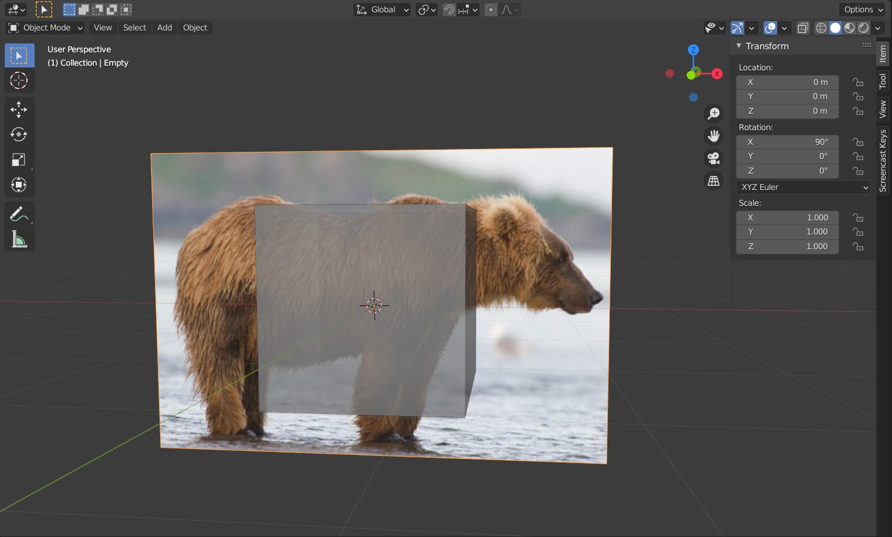
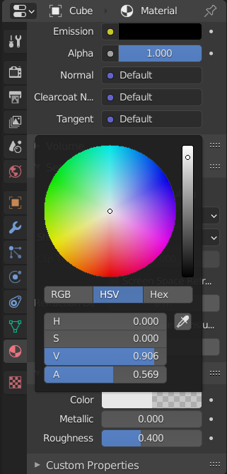

# Working with reference images

You can import a (reference) image in Blender in two different ways: As a reference, or as a background. A reference image behaves like a plane geometry with an image texture on both sides, background image is a plane that is always on bottom, and only visible from one side. Both of these images behave like traditional objects (you can scale them, rotate them, ...).  

To make your geometry transparent in the viewport, go to *Material* tab in the properties on the right of the viewport (red checkered ball), go to *Viewport display*, click on the color, and adjust the alpha of the color.

____
Mistakes? Bad grammar? Unclear wording? Outright wrong information?\
*kiraa@mail.muni.cz* is the one to blame!\
https://github.com/kiraacorsac/VV035-blender-study-materials/

Anything and everything dicussed here you can probably find in official documentation too, in more detail.
https://docs.blender.org/manual/en/latest/getting_started/index.html

