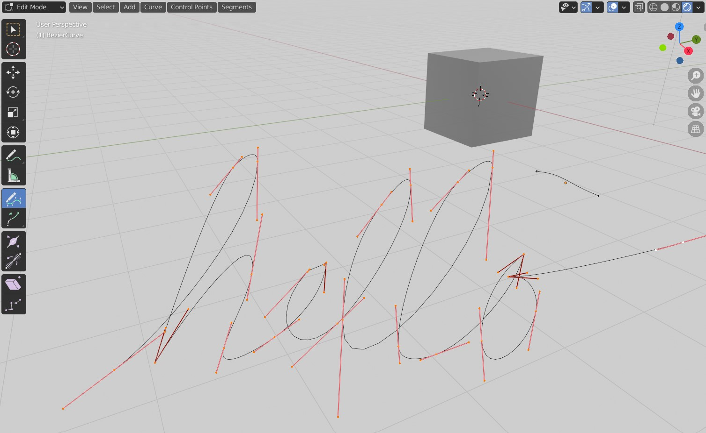
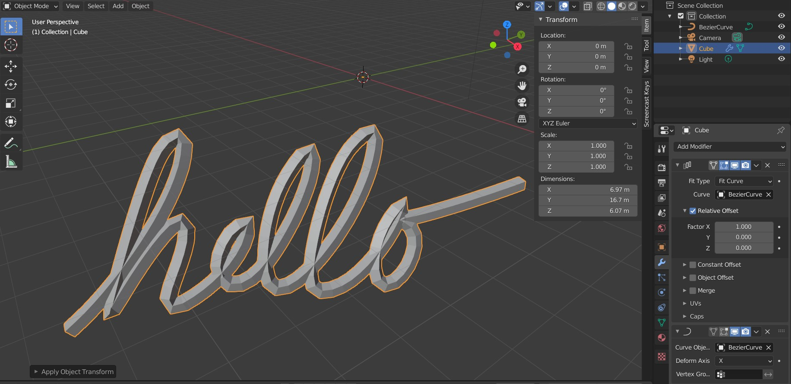

# Curves
*Curves* are objects expressed by mathematical functions, that take up a form of... well, a curve. They are useful for quickly and proceduraly creating an organic or a flexible form. 

## Working with curves. 

To add a curve, **Shift + A** and select a desired curve type. In general, *Path* and *Bezier* are the most useful, but if you need a closed loop, you can add the *Circle* curve. As *Bezier* curves are the most flexible and in my opinion the most useful, this workflow will discuss them primarily them.

After adding a curve, you can switch to *Edit mode* to start modifing the curve. First thing you will probably notice are the Bezier handles that allow you to adjust individual points, as you probably already know from other graphics software.

When you have a *Curve* selected, the tools available to you on the left are different as you might be used to from working with meshes. You can use the *Draw* tool to draw a freehand curve and use *Extrude* to add new curve segments. 

## Relations to modifiers

You can use curves to create scenes containing repeated geometry, or use it to create elongated organicaly behaving shapes like ropes, vines, or ornaments.

For that, you might be interested in repeating some geometry (be it the 'main' geometry, i.e. to create the rope, or appandages like leaves of the vines) along a curve. Select the mesh you want to repeat and make sure it is the correct size you need it to be later. Press **Ctrl+A** and choose *All Transforms*. Now select the curve, and also *Apply All Transforms* This is for the modifier in the next step - they do not work with unapplied transformations. (Note: if you use **S** to scale or **G** to move, that is a transformation, and needs to be applied for the next step to work properly.) 

After that, proceed to add an *Array* modifier to the mesh you want to repeat along the curve. In the *Fit Type* select *Fit Curve*. In the *Curve* select the desired curve. Furthermore, add a *Curve* modifier to the same object. Make sure you set the *Curve Object* to the same curve.

If you are getting weird results, make sure both the curve and the object has all transforms applied.

____
Mistakes? Bad grammar? Unclear wording? Outright wrong information?\
*kiraa@mail.muni.cz* is the one to blame!\
https://github.com/kiraacorsac/VV035-blender-study-materials/

Anything and everything dicussed here you can probably find in official documentation too, in more detail.
https://docs.blender.org/manual/en/latest/getting_started/index.html

