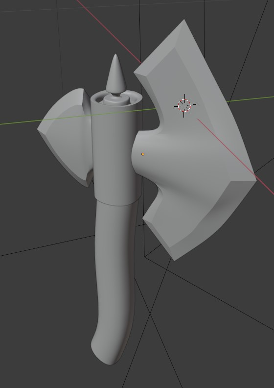
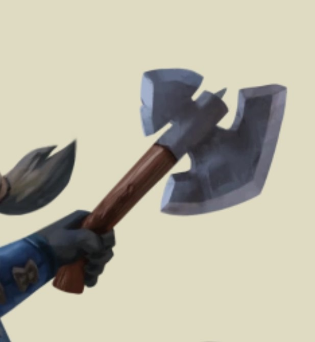
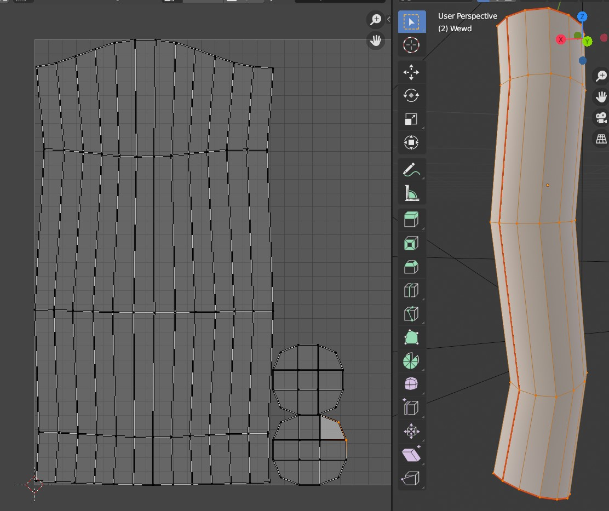
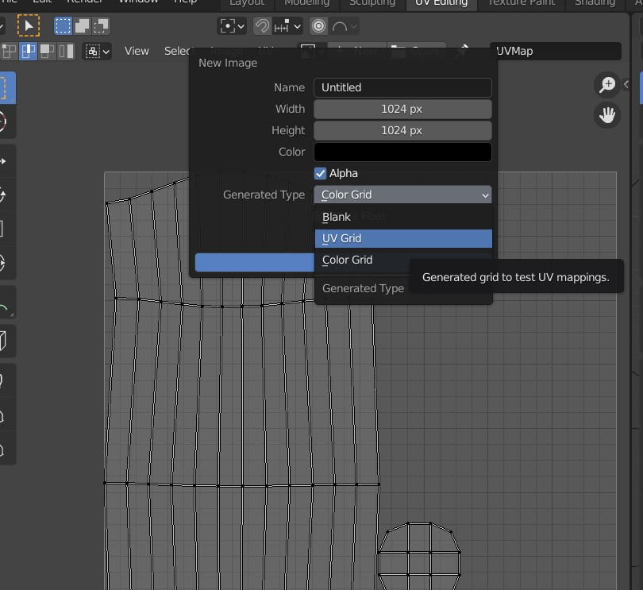
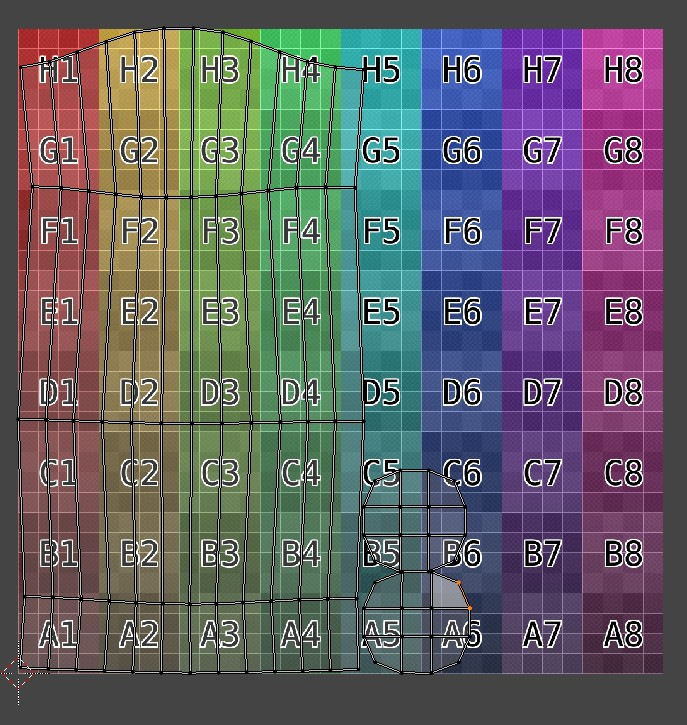
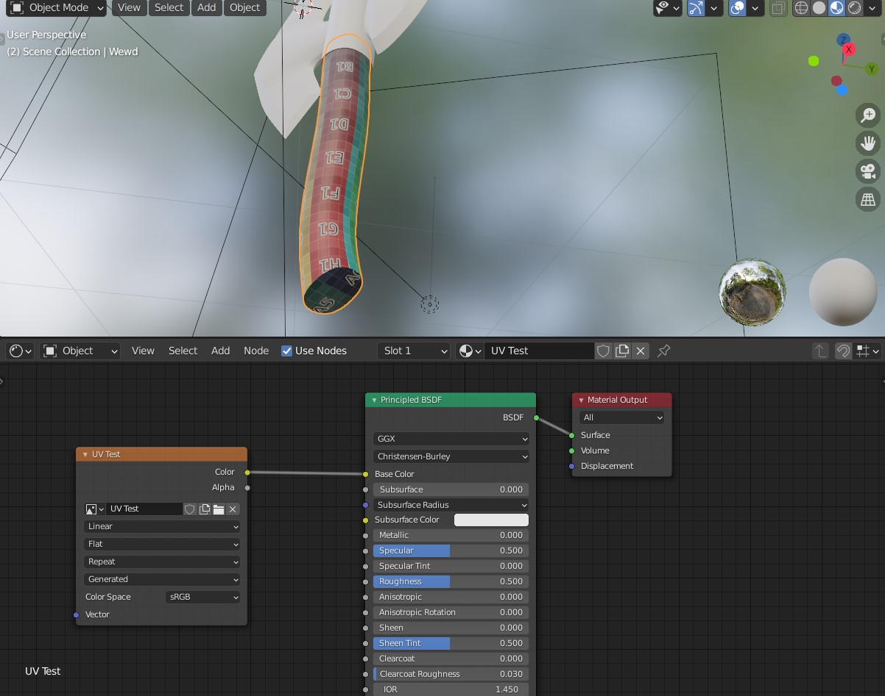
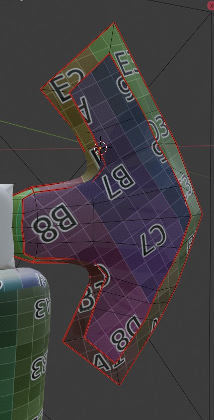

# UV Unwrap

*Tip: UV Unwrap is something that is much easier to show than to write about. Use this document as a reference, but make sure to visit the lecture too. If you already missed it, maybe search for some youtube tutorial, for example, Blender Guru: https://www.youtube.com/watch?v=scPSP_U858k*

In general, you intutively know what part of the 2D texture should go where on the 3D mesh you've created. However, computers don't have it so easy. To help it understand, you have to 'unwrap' the surface, similiar to peeling an orange.

In the core principle, UV unwraping is the act of placing seams on the model - places where you 'cut' the surface to flatten it. In general, you are trying to minimize the amount of seams, while preserving relative scale of the faces on the UV map. Of coure, seams hidden by other geometry are your friend!

*Tip: if you are planning to paint on your model instead of using textures downloaded from the internet, you can get away with any number of seams, just keep the unwrap faces of similiar scale. When painting, the 3D software knows where the seams are and will create texture that perfectly fits the UV map you've created.*

We are going to *UV Unwrap* this cartoonish axe, heavily inspired by the game *Armello* (see reference). It is composed of four objects: handle, middle part, small blade, big blade. On all of the objects, the *Subdivision Surface* modifier is applied, and some of the object are also using the *Mirror* modifier. We shall start with the handle, as it is probably the most obvious how to unwrap it.

Go to *UV Editing* workspace. To add a seam, make sure you are in edit mode. We will mark the top and the bottom as seams, as that is where the wood was cut, and we are definitely going to place different texture on the top and the bottom than the shaft. Select the edges (make sure you are in *Edge Selection* mode) where you want to place your seams, **Right-click** and select *Mark Seam*. Your edge should turn red. You can work one edge at the time or multiple edges at the same time - it does not matter.

After placing all the seams, select all geometry (**A**) and press **U**. Select *UV Unwrap*.  Our UV Map should appear on the left side of the window. Note that I temporarily turned off the subsurf modifier to make a more readable screenshot.

Now we should verify, whether the faces will look correctly after placing a texture. We do this using a special purpose texture. To create it, create a new texture in the left view, and in the upper menu select *New*, in *Generated Type* select *UV Grid* or *Color Grid* (does not matter) and press OK. Rename it from 'Untitled' to, for example, 'UV Test'

You should see this texture under your UV map, hover, probably NOT on your model. 

To get it to preview on the model, go to *Shading* workspace, add a new material to the unwraped object, rename it to 'UV View', **Shift+A** in the node editor to *Add*, search for *Image Texture*. Connect the *Image Texture* node to the base color, and select the 'UV Test' texture.

In a good UV unwrap, you are looking for the following features:
- the squares are not skewed or elongated,
- the squares are approximately uniform size,
- you can not see glaring cuts where is no change in material (sometimes unavoidable, as with the shaft of handle).

If you are missing one or more of these features, adjust your seams or your face placment on the UV Map. 

This is the UV Unwrap of the *BigBlade* object. Note that the material is supposed to change on the edge of the blade, where the metal has been grinded down. I'm using this to my advatage when placing the seams. Also note the small seams in the part that will be hidden iside the handle. These seams were enormously helpful to help blender create an unwrap with uniform scale, and they do not matter at all, as they will be hidden.

____
Mistakes? Bad grammar? Unclear wording? Outright wrong information?\
*kiraa@mail.muni.cz* is the one to blame!\
https://github.com/kiraacorsac/VV035-blender-study-materials/

Anything and everything dicussed here you can probably find in official documentation too, in more detail.
https://docs.blender.org/manual/en/latest/getting_started/index.html