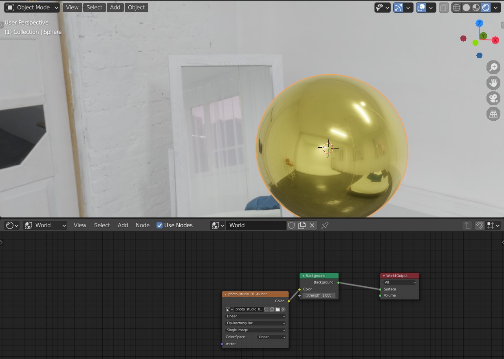
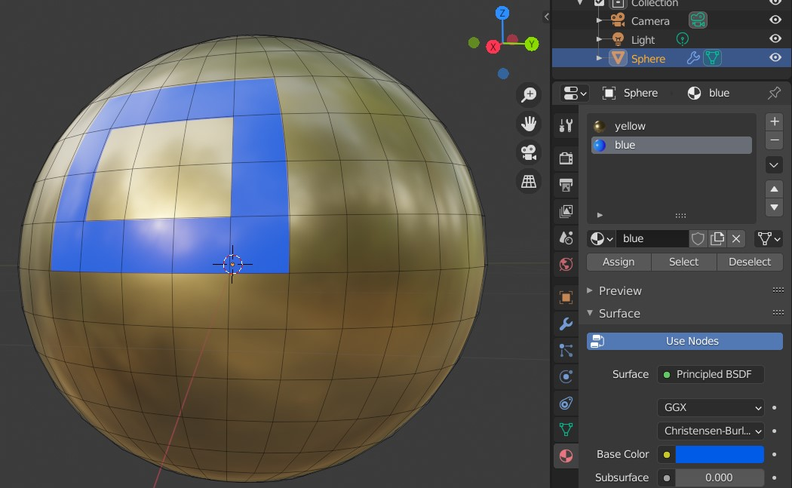
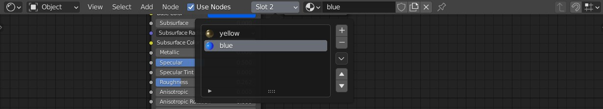

## HDRI Textures

If you want to make your reflective materials (especially metals) look good, you need to give them something to reflect. Also, you might want to quickly set up very realistic ambient lighting for your scene. For this purposes one uses an *HDRI* texture, or an *Environment Texture*. This is an 360° image that will give the additional pinch of realism that out-of-the-box reflective materials lack. 

In shading workspace, in the node editor, use the second-to-leftmost dropdown to change from *Object* to *World*. Press **Shift+A** and select *Environment Texture*. Conect it to the *Color* input of the *Background* node - your 'world' in the 3D viewport should turn bright pink, signaling missing texture. Click the *Open* button and select an HDRI texture of your choice.

## Material Slots

Sometimes, your model is non-uniform, as is composed of multiple materials. With the object of choice selected, go to the material properties on the leftside panel and click the *+* button on next to the (possibily empty) list of materials. Select (or create) a material. Repeat this process one more time from the *+* button step, so you have at least two materials in the list. In edit mode, select one or more faces. Afterwards, click on the desired material and then on the *Assign* button. You've just assigned multiple materials to a single object, in multiple material slots.

Now, in the *Shading* workspace, you can change the material slot you are working on via the *Slot* drop-down menu. 

____
Mistakes? Bad grammar? Unclear wording? Outright wrong information?\
*kiraa@mail.muni.cz* is the one to blame!\
https://github.com/kiraacorsac/VV035-blender-study-materials/

Anything and everything dicussed here you can probably find in official documentation too, in more detail.
https://docs.blender.org/manual/en/latest/getting_started/index.html