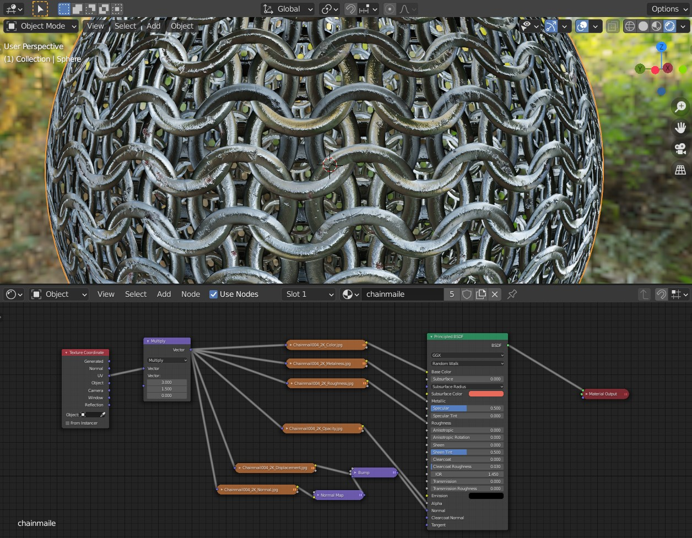

# Principled BSDF: deep dive

**My main source for information is the following video:
https://www.youtube.com/watch?v=4H5W6C_Mbck**

*Principled BSDF* is a physically accurate shader, that implements the PBR (Physically Based Rendering) Metalness workflow. 

## Advantages of PBR and the Principled BSDF shader

  - Consistency across lighting scenes
    ---
    With this shader, models will accurately reflect any amount of light. You should not need to use different materials depending on the lighting setup. 

  - Inbuilt fresnel and proper roughness
    ---
    Fresnel is the idea that the amount of specular reflectance you see on a surface depends on the viewing angle. As the angle widens, the reflectance is much higher.
    
    
    

  - Inbuilt metalness workflow
    ---
    One of the ways how to describe materials in PBR is with Metalness workflow. Nearly every material can be described as either a metal, or dialectric. The light behaves differtly - dialectrics refract at least a part of the light hitting the surface, the metals reflect or absorb it all. That means, metals are completly glossy, with no diffusion. This is of course true only for 'pure' metal, not rust, oxidization, or other dialectric elements on top of a metal. 
    
    The second difference is, metals have colored (specular) reflection. To be completely truthful, metals are *only* specular reflections, as in, all light that leaves the surface of the metal is directy reflected. Dialectric specular reflections are always white (not counting 'tricks' such as non-pigment color of some insects).

    Both of these are caused by the excess of free electrons in the metalic materials. Simply said, any light that enters the medium of a conductive metal is quickly absorbed, and never escapes the material again.
    
    

  - Cross-engine
    ---
  - Other in-build features
    ---
    - SSS
    - Anisotropic metals
    - Sheen
    - Clearcoat
    - Transparency

## Important Inputs

Note that for most of your renders, you need only a few of the inputs. For full explanation, refer to https://docs.blender.org/manual/en/latest/render/shader_nodes/shader/principled.html.

### Base Color
Percieved color, or the texture of the material.

### Metallic
Toggle between metals and dialectrits. Don't use values different than 0 and 1, unless you know very well what you are doing. 

### Roughness
Scales between sharp to blury reflections. Most of the time, if you want a material that generaly has no visible reflection, you want to put this value aaall the way down, and aaall the way up for shiny, reflective materials. Values in between are welcomed.

### Normal
Texture of the high fidelity details.

## Less Important Inputs

### Specular (Tint)
The specular value itself is set on 0.5, that is fine for most renders. If you are going for photorealism, you might want to calculate specular according to the equation
 $$specular=12.5\frac{(ior−1)^2}{(ior+1)^2}.$$

  Look the IOR up at
  - https://pixelandpoly.com/ior.html,
  - https://forums.cgsociety.org/t/a-complete-ior-list/1070401.
  Note that while this IOR is the same Index of Refraction as the IOR used in the IOR slider, the effect is different. IOR effects reflection too, not only refraction.

 The tint is, in general, not physically correct as it allows for colored reflections in dielectrics. It might be used for one of the few exemptions from the rule, or as a way to fake some complex materials.

 It has no effect on already metallic materials.

### Subsurface (Radius, Color)
  Useful when modeling skin, wax... Adds additional color 'under' the surface (i.e. skin is pretty pale, the flesh under the skin is more redish). Mimics the effect you get when you shine a torchlight trough your hand. 

### Anisotropic (Rotation, Tangent)
  Works only for Cycles. Elongation of specular reflection along a tangent. You can adjust the rotation. Useful for, i.e. brushed metal.

### Sheen (Tint)
  Subtle reflection on the edges. Useful for cloth, in combination with low specular.

### Clearcoat (Roughness, Normal)
  Applies a layer of tranclucent layer (imagine acrylic spray) on top of your model. Useful then modeling i.e. car paint.

### Transmission (Roughness, IOR)
  Translucency of the material. You probably know that index of refraction is. 
  Look the IOR up at
  - https://pixelandpoly.com/ior.html,
  - https://forums.cgsociety.org/t/a-complete-ior-list/1070401.

### Emission
  Light emmision - other way how to make a light. Currently not as powerful as an emmision shader. Note that to actually get any light out of it, you need to set the color to values above 1.

### Alpha
  True transparency (pretty much used only when 'carving' from your object). Works better in Cycles.

## Using texture maps

All of the above also takes textures - this is why we did all the UV unwapping last time.

Let's take a *UV Sphere* and apply some texture on it. I've chosen this PBR texture set: https://cc0textures.com/view?id=Chainmail004, because it has pretty much every texture known to man.

We will be always adding the *Image Texture* node and plugging it in the *Principled BSDF* shader.

### Color (Albedo, Diffuse)

Simplest one - just plug in the *Base Color*. Provides information about the diffuse reflection we percieve as color.

*Note: every texture that is NOT color should have **Color Space** set to **Non-Color**.*

### Metalness (Metallic)

Grayscale (usualy binary) map that provides information where is the material metal and where dielectric. Plugs in the *Metallic*. 

### Roughness

Greyscale, encodes reflectivity, as discussed above. Plugs in the *Roughness*.

### Normal
Distinctly looking two-color map, encodes height differences on the material. Plugs in the *Normal*, through the *Normal Map* node, where you can adjust *Strength* to your liking. 

### Opacity
Encodes visibility. It's a grayscale map, usualy binary. In this case it carves the free space between the individual rings. If using *Eevee*, make sure you have alpha blending enabled in the material properties -> *Settings* -> *Blend Mode* to *Alpha Clip* or *Alpha Blend*.  

### Displacment
Coarser height informaiton. Greyscale. Plugs in the *Material Ouput* node's *Displacment*. You need to pass it through *Vector Displacment* node first.  Works only in *Cycles*.

### Other
#### Ambient Occlusion (AO):
Irellevant for Blender and other modeling software, used mostly in games. Blender computes the information on the fly.

#### ID:
Assinges color to different parts of the texture (i.e. to differentiante materials, individual bricks of brick texture, individual wires of chainmail...)

#### Fuzz:
Map used to make 'hairy' fabric more realistic. Currently not implemented in Blender.

## Final touches
You can adjust the scale of every texture at once using this: add *Texture Coordinate* node, *Vector Math* node, connect *UV* output to the *Vector Math* input, set to *Multiply* and adjust scale in the other vector. Plug the output of the *Vector Math* to the *Vector* input of every texture.

Use nodes in the *Color* category to adjust brightness, contrast, ...

Don't forget to add HDRI.

Final result on a *UV Sphere*:

____
Mistakes? Bad grammar? Unclear wording? Outright wrong information?\
*kiraa@mail.muni.cz* is the one to blame!\
https://github.com/kiraacorsac/VV035-blender-study-materials/

Anything and everything dicussed here you can probably find in official documentation too, in more detail.
https://docs.blender.org/manual/en/latest/getting_started/index.html

In this single case, also refer to: https://static1.squarespace.com/static/58586fa5ebbd1a60e7d76d3e/t/593a3afa46c3c4a376d779f6/1496988449807/s2012_pbs_disney_brdf_notes_v2.pdf
https://docs.blender.org/manual/en/latest/render/shader_nodes/shader/principled.html
